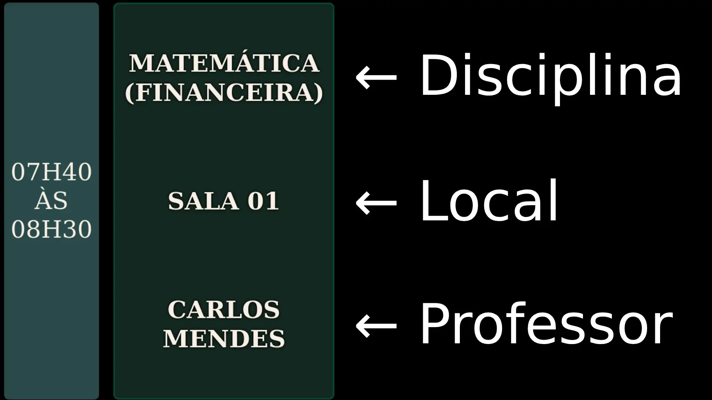
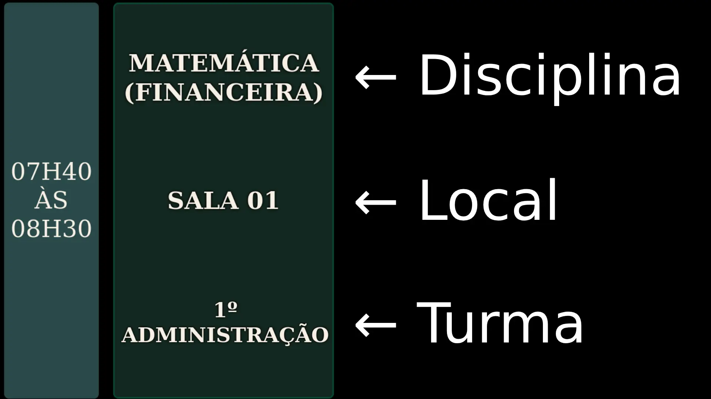
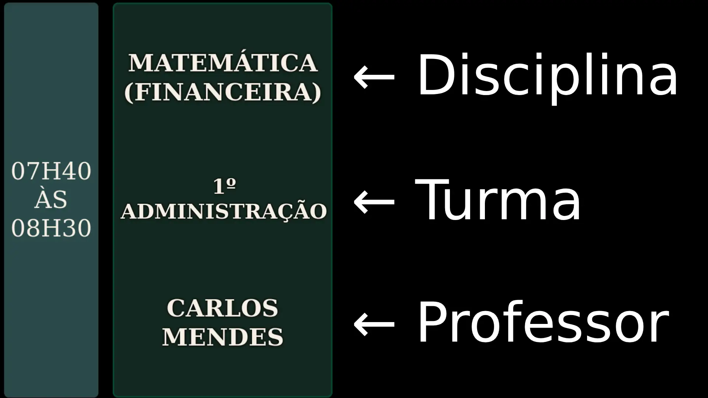
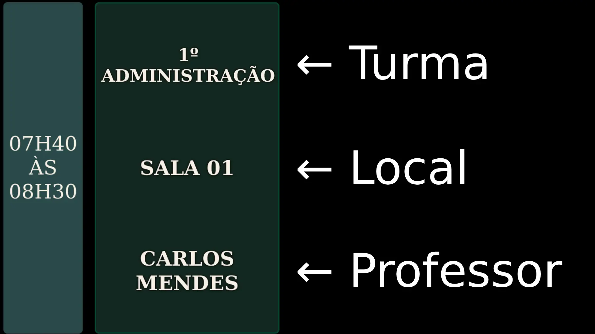
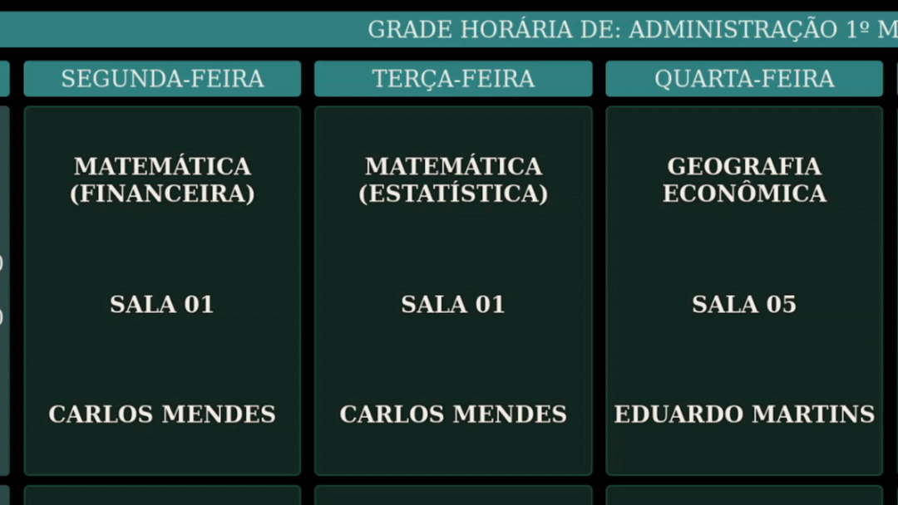
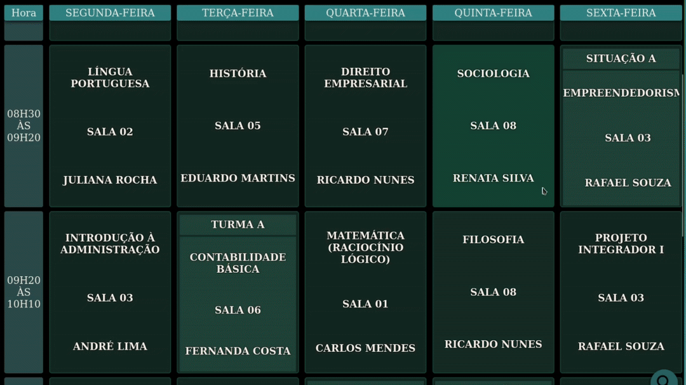
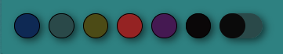
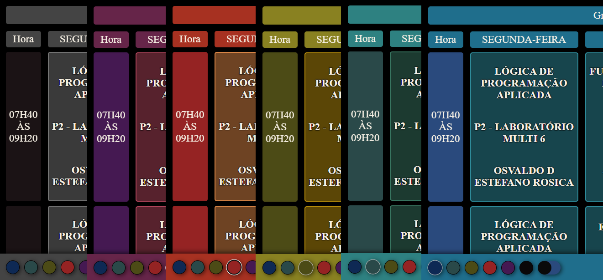
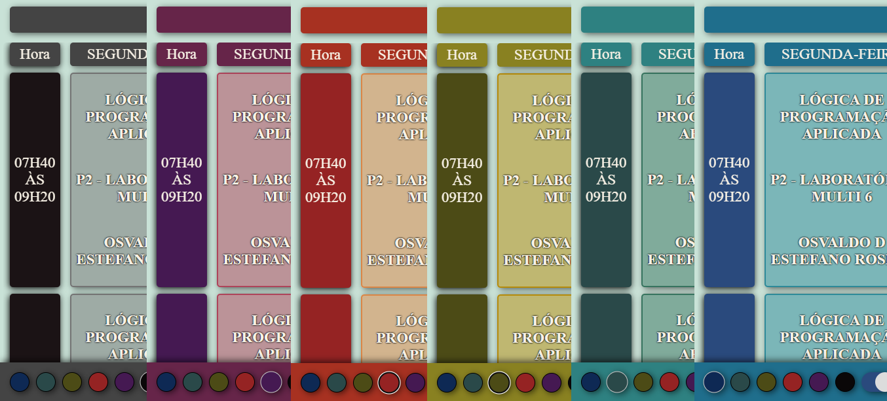
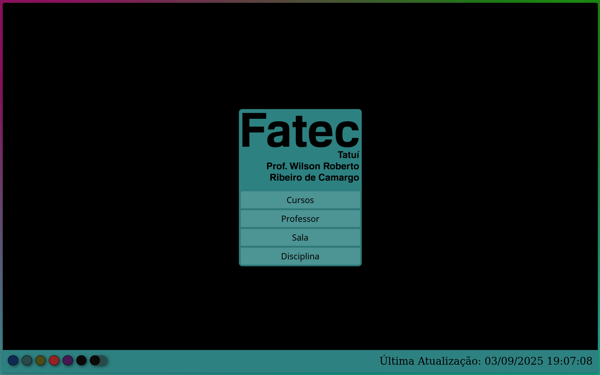

---
# F132horários - Uma Grade de Horários para Fatec Tatuí   
Este projeto é um site para visualização da **grade horária dos cursos da Fatec Professor Wilson Roberto Ribero de Camargo (Fatec Tatuí)** de forma clara e interativa.   
A interface apresenta os horários em **blocos organizados como um calendário**, permitindo visualizar rapidamente as aulas ao longo da semana.   
## Funcionalidades   
- 📅 V**isualização em formato de calendário   
    - As aulas são exibidas em blocos organizados por **dia da semana e horário**.   
- 🔎 F**iltros de visualização   
    - Filtragem dinâmica da grade horária por:   
        - **Curso**   
        - **Professor**   
        - Sala   
        - Disciplina   
        - Outros podem ser incluídos via código   
   
## Objetivo   
O objetivo do projeto é facilitar a **consulta da grade horária dos cursos da Fatec Tatuí (disponibilizada originalmente via uma planilha de eventos)**, permitindo que alunos e professores encontrem seus horários dentro de uma interface mais palatável:   
## Estrutura da Interface   
A grade é apresentada em formato semelhante a um **calendário semanal**, onde cada bloco representa uma aula, podendo conter:   
    
- Disciplina   
- Professor   
- Sala   
- Curso   
- Alguma outra informação necessária   
   
Há uma limitação nessa apresentação. Vamos colocar de exemplo que, numa segunda-feira, exista uma aula que comece às 7AM e termine as 8AM e, na terça, outra aula começando às 7AM e terminando às 9AM, nesses casos, duas linhas vão ser criadas, uma sendo das 7AM às 8AM e outra das 7AM às 9AM. O sistema espera que todos os horários sejam simétricos, dissonâncias nessa simetria vão gerar novas linhas com horários "repetidos".   
### Visualização da pesquisa de cursos   
Visualização padrão, direcionada aos discentes da instituição. O horários são dispostos em blocos dentro de uma grade e, cada bloco, apresenta, respectivamente, o título da disciplina em questão, seu local de execício e o ministro da matéria.   
    
### Dados do evento    
|      Dia da Semana |         Horário |           Curso | Semestre |  Período |               Disciplina |       Docente | Local de Aula |
|:-------------------|:----------------|:----------------|:---------|:---------|:-------------------------|:--------------|:--------------|
| 01 - Segunda-feira |  07h40 às 08h30 |   Administração |       1º | Matutino |  Matemática (Financeira) | Carlos Mendes |       Sala 01 |

### Visualização da pesquisa de professores   
Visualização destinada à docentes presentes na instituição. Por nome é possível filtrar uma grade com as disciplinas ministradas pelo docente selecionado. Cada bloco de evento apresenta, respectivamente, o título da disciplina em questão, seu local de execício e a turma ao que se destina a aula.   
    
### Dados do evento    
|      Dia da Semana |         Horário |           Curso | Semestre |  Período |               Disciplina |       Docente | Local de Aula |
|:-------------------|:----------------|:----------------|:---------|:---------|:-------------------------|:--------------|:--------------|
| 01 - Segunda-feira |  07h40 às 08h30 |   Administração |       1º | Matutino |  Matemática (Financeira) | Carlos Mendes |       Sala 01 |

### Visualização da pesquisa de salas   
Dentre as visualizações possíveis, a visualização de sala apresenta todos os eventos ativos em uma determinada sala de aula. Nesse caso, os blocos de evento apresentam, respectivamente, o título da disciplina em questão, a turma a que se destina o evento e o ministro da matéria.   
    
### Dados do evento    
|      Dia da Semana |         Horário |           Curso | Semestre |  Período |               Disciplina |       Docente | Local de Aula |
|:-------------------|:----------------|:----------------|:---------|:---------|:-------------------------|:--------------|:--------------|
| 01 - Segunda-feira |  07h40 às 08h30 |   Administração |       1º | Matutino |  Matemática (Financeira) | Carlos Mendes |       Sala 01 |

Fora visualizar as matérias de uma sala em específico, temos opção de pesquisar por "Salas livres", onde, a grade resultante apresenta, em cada bloco de eventos, uma lista de salas que se encontram vazias durante aquele intervalo de tempo.   
    
### Visualização da pesquisa de disciplinas   
Por fim, também há a possibilidade de pesquisar matérias específicas ministradas na instituição. Nessa apresentação, temos, respectivamente: a turma que assiste a disciplina, seu local execício e o ministro da matéria.   
    
### Dados do evento    
|      Dia da Semana |         Horário |           Curso | Semestre |  Período |               Disciplina |       Docente | Local de Aula |
|:-------------------|:----------------|:----------------|:---------|:---------|:-------------------------|:--------------|:--------------|
| 01 - Segunda-feira |  07h40 às 08h30 |   Administração |       1º | Matutino |  Matemática (Financeira) | Carlos Mendes |       Sala 01 |

## Visualização de informações adicionais   
Eventualmente, se faz necessário agregar informações extras à visualização, para tal, dentro da lógica desse sistema, qualquer coluna "não essencial" para a composição dos eventos é considerada como uma coluna de informações extras. E, toda informação extra é concatenada e anexada dentro dos blocos de evento como um item oculto, visível através de eventos `hover.`   
    
### Dados dos eventos com informações extras   
|      Dia da Semana |         Horário |           Curso | Semestre |  Período |                 Disciplina |         Docente | Local de Aula |   Informação Auxiliar |
|:-------------------|:----------------|:----------------|:---------|:---------|:---------------------------|:----------------|:--------------|:----------------------|
| 01 - Segunda-feira |  07h40 às 08h30 |   Administração |       1º | Matutino |    Matemática (Financeira) |   Carlos Mendes |       Sala 01 |           Aula online |
|   02 - Terça-feira |  07h40 às 08h30 |   Administração |       1º | Matutino |   Matemática (Estatística) |   Carlos Mendes |       Sala 01 |           Aula online |
|  03 - Quarta-feira |  07h40 às 08h30 |   Administração |       1º | Matutino |        Geografia Econômica | Eduardo Martins |       Sala 05 |           Aula online |

## Visualização de horários concorrentes   
Dependendo do caso, podem haver múltiplos eventos num mesmo horário dentro de uma visualização (por exemplo, uma aula fixa em sala com reservas pontuais em laboratório). Nesses casos haverá uma duplicidade de horários e a apresentação se dá através de um mesmo bloco de evento com múltiplas abas dentro desse bloco, acessíveis ao deslocar o bloco horizontalmente.   
    
Seguindo essa lógica, uma coluna "turma" pode ser adicionada na tabela para identificar o motivo das duplicidades. Na lógica padrão, sem uma designação apropriada, cada duplicidade é apresentada como uma "Situação X", ordenadas pela ordem dos itens na tabela, atribuindo uma letra conforme uma sequência alfabética.   
Na coluna "turma" um texto simples pode ser inserido para designar o motivo dessa duplicidade. O exemplo em questão referencia divisões de turmas - a matéria é a mesma, para a mesma turma, num mesmo horário mas metade de uma turma fica numa sala com um professor, enquanto o restante da turma fica num laboratório - nessa idea, foi inserido na tabela fonte as descrições "Turma A" e "Turma B", que, na grade, identificam o motivo da duplicidade com um rótulo acima do bloco da aula.   
### Dados dos eventos em concorrência   
|      Dia da Semana |         Horário |           Curso | Semestre |  Período |            Disciplina |        Docente | Local de Aula |   Turma |   Informação Auxiliar |
|:-------------------|:----------------|:----------------|:---------|:---------|:----------------------|:---------------|:--------------|:--------|:----------------------|
| 01 - Segunda-feira |  07h40 às 08h30 |   Administração |       1º | Matutino |      Empreendedorismo |   Rafael Souza |       Sala 03 |         |           Aula online |
| 01 - Segunda-feira |  07h40 às 08h30 |   Administração |       1º | Matutino |      Empreendedorismo |   Rafael Souza |   Lab Info 01 |         |           Aula online |
|   02 - Terça-feira |  07h40 às 08h30 |   Administração |       1º | Matutino |  Contabilidade Básica | Fernanda Costa |       Sala 05 | Turma A |           Aula online |
|   02 - Terça-feira |  07h40 às 08h30 |   Administração |       1º | Matutino |  Contabilidade Básica | Fernanda Costa |   Lab Info 02 | Turma B |           Aula online |

## Temas e cores do sistema   
Na barra inferior do sistema, existem alguns botões para definição de temas para a aplicação, é uma seleção bem simples entre tema claro e escuro além de algumas opções de cores de destaque. Seguem os exemplo:   
### botões de seleção do tema e cores   
    
Os primeiros botões representa as 6 paletas de cor possíveis e, o último botão, um swtich para alternar entre o tema claro e o escuro.   
### Paletas de cor para o tema escuro   
    
### Paletas de cor para o tema claro   
    
## Interface mobile e responsividade   
O sistema de grade horária conta com uma cadeia básica de argumentos CSS para apresentar uma boa responsividade para diferentes tamanhos e tela e, principalmente, para operar em dispositivos móveis.   
    
## Fontes de dados para a grade horária   
Este projeto de site utiliza como base uma tabela horários definida pelo gestor acadêmico da Fatec Tatuí, requisitando essas informações através do modo de publicação de planilhas do Google Sheets.   
Dentro dessa lógica, o site faz um request http à fonte de dados. Originalmente, o projeto trabalhava utilizando arquivos do tipo CSV, migrando para  TSV, processando esses arquivos para um formato JSON. Como código legado, as funções de conversão de CSV/TSV para JSON ainda seguem presentes e disponíveis para uso.   
Várias amostras já foram mencionadas nesse texto mas, reiterando o assunto, segue um exemplo de tabela de eventos válida com fonte de dados:   
|      Dia da Semana |         Horário |                       Curso | Semestre |  Período |                        Disciplina |         Docente | Local de Aula |   Turma |   Informação Auxiliar |
|:-------------------|:----------------|:----------------------------|:---------|:---------|:----------------------------------|:----------------|:--------------|:--------|:----------------------|
| 01 - Segunda-feira |  07h40 às 08h30 | Desenvolvimento de Sistemas |       1º | Matutino |    Matemática (Lógica Matemática) |   Carlos Mendes |       Sala 01 |         |        Aula cancelada |
| 01 - Segunda-feira |  08h30 às 09h20 | Desenvolvimento de Sistemas |       1º | Matutino |                 Língua Portuguesa |   Juliana Rocha |       Sala 02 |         |                       |
| 01 - Segunda-feira |  09h20 às 10h10 | Desenvolvimento de Sistemas |       1º | Matutino |         Fundamentos da Computação |      André Lima |   Lab Info 01 |         |                       |
| 01 - Segunda-feira |  10h10 às 10h30 |                             |          | Matutino |                                   |                 |         Pátio |         |                       |
| 01 - Segunda-feira |  10h30 às 11h20 | Desenvolvimento de Sistemas |       1º | Matutino |             Lógica de Programação |    Rafael Souza |   Lab Info 01 | Turma A |        Aula cancelada |
| 01 - Segunda-feira |  11h20 às 12h10 | Desenvolvimento de Sistemas |       1º | Matutino |                    Inglês Técnico |    Marina Alves |       Sala 03 |         |                       |
|   02 - Terça-feira |  07h40 às 08h30 | Desenvolvimento de Sistemas |       1º | Matutino |           Matemática (Algoritmos) |   Carlos Mendes |       Sala 01 |         |                       |
|   02 - Terça-feira |  08h30 às 09h20 | Desenvolvimento de Sistemas |       1º | Matutino |                          História | Eduardo Martins |       Sala 04 |         |        Aula cancelada |
|   02 - Terça-feira |  09h20 às 10h10 | Desenvolvimento de Sistemas |       1º | Matutino |       Arquitetura de Computadores |      André Lima |   Lab Info 02 |         |                       |
|   02 - Terça-feira |  10h10 às 10h30 |                             |          | Matutino |                                   |                 |         Pátio |         |        Aula cancelada |
|   02 - Terça-feira |  10h30 às 11h20 | Desenvolvimento de Sistemas |       1º | Matutino |                     Programação I |    Rafael Souza |   Lab Info 01 | Turma A |                       |
|   02 - Terça-feira |  11h20 às 12h10 | Desenvolvimento de Sistemas |       1º | Matutino |                  Banco de Dados I |  Fernanda Costa |   Lab Info 02 | Turma A |                       |
|  03 - Quarta-feira |  07h40 às 08h30 | Desenvolvimento de Sistemas |       1º | Matutino |                          Biologia |    Renata Silva |       Sala 05 |         |           Aula online |
|  03 - Quarta-feira |  08h30 às 09h20 | Desenvolvimento de Sistemas |       1º | Matutino |                            Física |   Lucas Pereira |        Lab 01 |         |                       |
|  03 - Quarta-feira |  09h20 às 10h10 | Desenvolvimento de Sistemas |       1º | Matutino |          Matemática (Estatística) |   Carlos Mendes |       Sala 01 |         |        Aula cancelada |
|  03 - Quarta-feira |  10h10 às 10h30 |                             |          | Matutino |                                   |                 |         Pátio |         |                       |
|  03 - Quarta-feira |  10h30 às 11h20 | Desenvolvimento de Sistemas |       1º | Matutino |             Sistemas Operacionais |  Bruno Teixeira |   Lab Info 02 |         |                       |
|  03 - Quarta-feira |  11h20 às 12h10 | Desenvolvimento de Sistemas |       1º | Matutino |                   Educação Física |   Camila Duarte |        Quadra |         |                       |

Dentro da pasta [`exemple_sources`](exemple_sources) pode ser encontrada a versão completa dessa tabela

Nessa tabela temos as seguintes colunas:   
1. **Dia da Semana** - Apresenta o dia da semana em que a o evento acontece   
2. **Horário** - Apresenta o horário do evento (seguindo o padrão HHhMM às HHhMM, ex: 10h30 às 11h20)   
3. **Curso** - Nome do curso referente à turma que assistirá o evento   
4. **Semestre** - Semestre do curso   
5. **Período** - Turno de identificação do curso (manhã, tarde, noite, madrugada…)   
6. Disciplina - Aula/matéria a ser ministrada durante o evento   
7. Docente - Ministro da matéria   
8. Local de Aula - Sala onde ocorrerá o evento   
9. Turma - Coluna destinada à identificações de aulas concorrentes ou divisões de turmas   
10. Informação Auxiliar - Campo destinado à observações pontuais sobre o evento   
   
As colunas destacadas em negrito são essenciais para a triangulação dos eventos, elas abastecem os filtros e preenchem os blocos de eventos. Campos nulos nessas colunas vão  invalidar o processo de pesquisa.   
As colunas "Docente" e "Local de Aula" podem ficar vazias, mas, consequentemente, os filtros por nome de professor e sala serão inutilizados.   
Colunas extras podem ser inseridas na tabela e, todas colunas além das 10 mencionas serão consideradas como parte das informações extras.   
## Arquivo de parâmetros   
Para facilitar um pouco alguns ajustes mais mundanos dentro da lógica do sistema, o arquivo [`parameters.js`](parameters.js), foi escrito no intuito de definir:   
1. Os nomes originais nas colunas da tabela: caso o usuário tenha uma tabela pronta que já contenha uma formatação compatível com esse sistema, apenas com os nomes das colunas diferentes ou caso ele queria mudar um nome de coluna sem ter que reescrever trechos do código inteiro, ele pode, através do arquivo de parâmetros, configurar quais são os nomes verdadeiros das colunas. Dentro do código, quando uma fonte de dados é requisitada, ela é reescrita em um formato JSON e, o indexes desse JSON seguem uma variável global declarada no arquivo de parâmetros. A declaração segue esse formato:   
    ```
    const clmnHdrs = {
        dia: "dia da semana",
        hora: "horário",
        curso: "curso",
        semestre: "sem.",
        siga: "siga",
        turno: "período",
        materia: "disciplina",
        professor: "docente",
        sala: "local de aula",
        turma: "turma",
        info: "informação auxiliar"
    }
    ```
    Os indexes (dia, hora, curso…) são usados globalmente no código e seus valores apontam pros nomes reais das colunas na fonte de dados.   
2. O endereço http onde o sistema busca as fontes de dados: múltiplas fontes de dados podem ser vinculadas nessa variável, todas sendo mescladas no final do processo de requisição. Mas existe uma limitação nesse sistema, todas as fontes de dados devem possuir a mesma estrutura e formatação (a ordem das colunas não é relevante, mas seus nomes sim) e, principalmente, os mesmos nomes. No item anterior foi dito que os nomes das colunas podem ser especificados e não precisam ser fixos - e, de fato, podem - mas dentro da liberdade na escolha dos nomes, os nomes escolhidos devem ser os mesmos para todas as fontes de dados. As fontes são declaradas da seguinte maneira:   
    ```
    const sources = [
        {
            URL: `./exemple_sources/grade.csv`,
            FileType: "csv",
        },
        {
            URL: `./exemple_sources/agendas.tsv`,
            FileType: "tsv",
        },
    ];
    ```
    Aqui temos um array contendo múltiplos JSONs, neles declaramos qual a URL da fonte e qual o tipo de arquivo, podendo ser CSV, TSV ou JSON   
3. Variável contendo o valor da última atualização: aqui, como uma fonte da dados auxiliar, pode ser vinculado um dado contendo a data da última atualização nas fontes. Segue um exemplo de declaração dessa variável:   
    ```
    const excelLastEditedSource = {
        URL: "./exemple_sources/atualiasdza.tsv",
        FileType: "tsv",
        InfoPosition: [0,1]
    };
    ```
    Aqui, temos uma sintaxe muito parecida com a a declaração de fontes, com um detalhe extra: a coordenada da informação. Considerando que todo esse projeto trabalha com tabalas, essa variável considera a possibilidade da informação desejada estar dentro de alguma célula numa tabela. Portanto, existe a possibilidade de declara em qual célula da tabela a informação está contida, por exemplo:    
    |  Ultima Edi. | 03/09/2025 19:07:08 |
    |:-------------|:--------------------|
    | Ultima Sinc. | 03/09/2025 22:01:41 |

    Nessa tabela temos duas linhas e duas colunas, mas precisamos apenas da informação contida na segunda coluna (index 1) dentro da primeira linha (index 0). Então declaramos a posição da informação como "[0, 1]";   
    E, dentro da interface, essa informação fica na barra inferior, ao lado direito, como na imagem a seguir:   
        
4. Omissão de campos de pesquisa: ao abrir o sistema, o usuário se depara (dentro do escopo desse projeto) com 4 opções de pesquisa: cursos, professores, salas e disciplinas. Mas, dependendo da visão imposta na implementação desse projeto, haverá a necessidade omitir alguns campos de pesquisa. Para sanar essa necessidade, pode-se declara a seguinte variável nos parâmetros:   
    ```
    const hideFilters = [
        "sala",
        "materia"
    ]
    ```
    Essa variável consiste numa lista de palavras que fazem referência aos IDs dos elementos HTML com os tipos de pesquisa, segue um exemplo dos botões dentro do [`index.html`](index.html)
    ```
    <div class="prsnBox" id="prsnBox" onclick="$('#prsnBox').css('flex-direction', 'row')">
        <button id="bt-curso" class="btP" onclick="fndStdt()">Cursos</button>
        <button id="bt-professor" class="btP" onclick="fndTchr()">Professor</button>
        <button id="bt-sala" class="btP" onclick="fndClsR()">Sala</button>
        <button id="bt-materia" class="btP" onclick="fndClss()">Disciplina</button>
    </div>
    ```
    Nesse caso, os botões de pesquisa por sala e disciplina não serão apresentados, resultando nessa apresentação:   
        
5. Omissão de itens dentro das lista de filtros: durante o processo de tratamento dos dados, alguns valores podem ser ignorados e trocados por espaços vazios, no intuito de filtrar algumas palavras ou padrões dentro do texto. Para isso, dentro dos parâmetros temos duas variáveis para filtragem de palavras específicas e padrões generalizados, declaradas da seguinte maneira:   
    ```
    const ignoredWordFilters = {
        geral: [],
        dia: [],
        hora: [],
        curso: [
            "etec",
            "novotec",
            "reserv",
        ],
        semestre: [
        ],
        siga: [],
        turno: [],
        materia: [
            "etec",
            "novotec",
            "reserv",
        ],
        professor: [
            "etec",
            "novotec",
            "reserv",
        ],
        sala: [],
        info: [],
    }
    
    const ignoredExclusiveFilters = {
        geral: [
            "",
            " ",
            "-",
            " - ",
            undefined,
            null,
        ],
        dia: [],
        hora: [],
        curso: [],
        semestre: [
        ],
        siga: [],
        turno: [],
        materia: [],
        professor: [],
        sala: [],
        info: [],
    }
    ```
    Ambas variáveis seguem uma estrutura idêntica à variável com os nomes das colunas mas, nesse caso, podemos escolher filtrar padrões para todos os campos, ou apenas para campos específicos dentro da fonte de dados. Por exemplo, filtrar palavras que contenham "ana" em todos os campos da tabela, e filtrar o numéro "1" apenas na coluna dos semestres. Cada índice contém uma lista de palavras que podem ser inseridas para criar múltiplos filtros e múltiplas camadas de filtragem.   
    Em `ignoredExclusiveFilters` colocamos palavras, ou frases a serem removidas de forma exclusiva, colocar "Banana" em um dos itens dessa variável somente removerá o valor caso a célula da tabela tenha exatamente o valor "Banana" contida nela. Caso exista "Banana 1", " Banana", "banana ", ou qualquer coisa diferente de "Banana", a célula não será afetada. Com pode ser visto, o único uso padrão dessa variável é para limpeza de campos essencialmente vazios, mas com algum caractere atuando como placeholder.   
    Em `ignoredWordFilters` temos uma filtragem mais abrangente e generalista. Aqui, utilizamos padrões case-insensitive, ou seja, colocar "banana" no índice geral, irá filtrar células contendo "Banana", "BaNaNa", "\_banana" e/ou "Isso é banana dentro da frase". Seja uma palavra, capitalizada ou não, ou uma frase completa, o filtro `ignoredWordFilters` vai limpar a célula por completo. Nesse caso, dentro do uso padrão, o filtro está sendo utilizado para omitir algumas opções de cursos cujos horários não seguem um padrão, ou existem apenas para servir como anotações dentro da tabela.   
   
## Rodando o projeto e fazendo deploy   
Inicialmente, esse projeto não tem um grande escopo e visa ser rodando em hospedagem estáticas. Dentro dessa pretensão, para executar esse projeto basta apenas:   
1. Realizar o git clone desse repo com:   
    ```
    git clone https://github.com/GERALTdTATUI/F132Horarios.git
    ```
2. Hospedar o projeto   
    - Copiar a pasta do projeto para htdocs dentro de uma hospedagem usando xampp, ou seu sistema de hosting preferido   
    - Ou, usando o vs-code, através da extensão [live-server](https://marketplace.visualstudio.com/items?itemName=yandeu.five-server), clicar com o botão direto no [`index.html`](index.html) e clicar em "Abrir com live server"   
   
Seguindo esses passos, uma versão base do site com horário fictícios deve aparecer como forma de desmonstração   
## Observações sobre hospedagens e o arquivo de parametros   
Dentro desse escopo não há necessidade de omitir as variáveis, sendo assim, não existe ainda uma opção de usar .env e injeção de variáveis dentro do ambiente backend. Todas as variáveis ficam expostas no arquivo paramenters.js para quem quiser inspecionar a página.   
Dentro desse projeto há um arquivo parameters.template.js que serve como base para injeção de variáveis usando o arquivo de build [`build.sh`](build.sh), o mesmo apenas substitui os campos das variáveis com as variáveis de ambiente armazenadas no servidor de host.   
## Possíveis melhorias futuras   
- Exportação da grade para **PDF ou imagem **(parcialmente feito)   
- Desenhar a arquitetura do projeto para funcionar em nodeJS com injeção de variáveis no contexto do backend   
- Alterar as estruturas dos blocos pra seguir uma regra de "alturas" para os horários ao invés de trilho